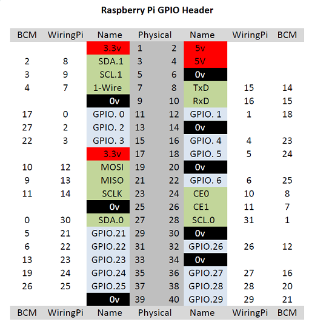

# GPIO-Pins

Bevor wir mit dem Unterricht beginnen, sollten wir etwas über den Raspberry Pi (RPi) wissen: GPIO-Nutzung und die Grundbefehle der Programmiersprache Python3.
Der RPi steuert externe Module und Sensoren über Pins, die _GPIO-Pins_ genannt werden.
GPIO steht für _General Purpose Input Output_, was bedeutet, dass wir diese Pins für verschiedene Eingabe- und Ausgabebefehle verwenden können.
Um die GPIO-Pins zu verwenden, müssen wir zuerst ihren Modus einstellen.
Es gibt zwei Modi: der erste Modus ist `GPIO.BCM`, der zweite Modus ist `GPIO.BOARD`.
Tauchen wir tiefer ein, um zu verstehen, was diese Modi bedeuten und wie sie funktionieren.



Die Option `GPIO.BOARD` Option gibt an, dass Nummern, die du programmierst den physischen (in der Mitte des Diagramms: _Physical_) entsprechen.
Die Option `GPIO.BCM` bedeutet, dass du die Nummern des "Broadcom SOC channel" (BCM) zum Programmieren nimmst (auf beiden Seiten des Diagramms).

Der Einfachheit halber, verwenden wir im Unterricht `GPIO.BCM` und **nicht** `GPIO.BOARD`.
Alle von uns markierten Pins auf der Platine sind funktionale Pins, z.B. haben wir den Buzzer mit `GPI01` unter Funktionsmodus (die Spalte mit der Bezeichnung Name) markiert, aber wir müssen den Buzzer mit `GPI018` im BCM-Modus programmieren.

# Python

Als nächstes werden wir eine kurze Einführung in Python geben.
Python ist populäre Programmiersprache, und eine sehr einfache.

In unserem Unterricht werden wir Python3, die neueste Python-Version, verwenden. beginnen wir mit einigen einfachen Anweisungen für den Einstieg in Python.

Das erste Projekt für jeden, der Python lernt, ist `"Hello World"`. Wir können das erreichen, indem wir "Hello World" über unsere Konsole ausgeben, aber wie?
Python hat eine eingebaute Funktion namens `"print"`, mit der wir alles in unserer Konsole ausgeben können. Versuchen wir es mal:

```
print("Hello World")
```

Gut gemacht!

## Python- Bibliotheken

Weiter geht es mit dem Thema Bibliotheken.
Wir importieren die Bibliotheken am Anfang unseres Codes.
Sie enthalten Funktionen, die wir aufrufen können, um bestimmte Befehle auszuführen.
Die gebräuchlichsten Bibliotheken, die wir verwenden, sind `time` und `RPi.GPIO`.

```
import RPIO.GPIO as GPIO
import time
```

Die `RPi.GPIO`-Bibliothek erlaubt es uns, Befehle auszuführen, die `GPIO INPUT` und `OUTPUT` steuern, wie wir es oben bei der Einführung der `GPIO`-Pins besprochen haben.

Die Zeitbibliothek ermöglicht es uns, das Programm zu verzögern, damit wir genug Zeit haben, um eine bestimmte Funktion auszuführen.
Wir verwenden dazu die Funktion `sleep` innerhalb der Zeitbibliothek. Zum Beispiel:

```
time.sleep(1)
```

Mit dem Befehl `time.sleep(1)` wartet unsere Software 1 Sekunde bevor sie weiterarbeitet.
